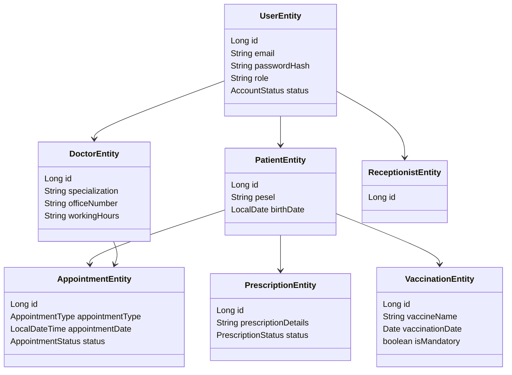

# Architecture Overview – Health Reservation System

## 🧩 System Overview

The Health Reservation System is a full-stack application that allows users to register, book appointments (stationary or teleconsultation), request prescriptions, and view vaccination history. The system includes multiple roles (patient, doctor, receptionist, admin), JWT-based authentication, and persistent PostgreSQL storage managed with Liquibase.

---

## 🏗️ Core Components

### Backend (Spring Boot)
- **Controller Layer** – exposes REST API endpoints for login, registration, user management, and appointments
- **Service Layer** – contains business logic and security-related processing
- **Repository Layer** – uses Spring Data JPA to access the database
- **JWT Authentication** – stateless login with `Authorization: Bearer <token>`
- **SecurityConfig** – configures access per role, public/private endpoints, and filters
- **Liquibase** – manages schema and test data

### Frontend (React)
- **Pages** – `HomePage`, `LoginForm`, `Dashboard`
- **React Router** – client-side navigation
- **Axios** – connects to backend APIs
- **State** – token stored in `localStorage`, redirect after login

### Database (PostgreSQL)
- Tables: `users`, `patients`, `doctors`, `receptionists`, `appointments`, `prescriptions`, `vaccinations`
- All schema changes and initial data handled with Liquibase

---

## 👤 User Roles and Access Flow

- **PATIENT** – can register, log in, view/book appointments, request prescriptions
- **DOCTOR** – sees assigned appointments, confirms/rejects
- **RECEPTIONIST** – confirms bookings, manages patient accounts
- **ADMIN** – activates new users, manages full user list

### Registration flow:
1. User registers (status: `PENDING`)
2. Admin confirms user → status changes to `ACTIVE`
3. User can log in and receive JWT

---

## 🔐 Security

- JWT token is generated on `/login` and attached to `Authorization` header
- Token is verified on every request by `JwtAuthenticationFilter`
- Role-based access is enforced with `.hasRole(...)` and `@PreAuthorize`

Example:
```
.requestMatchers("/admin/**").hasRole("ADMIN")
```

---

## 🗂️ Entity Diagram


---

## 🧪 Testing Strategy

The backend includes unit and integration tests:

- **Service layer** – tested with Mockito (`UserServiceTest`)
- **JWT generation and parsing** – (`JwtTokenUtilTest`)
- **Mapper correctness** – (`UserMapperTest`)
- **Authentication and registration flow** – full-stack via `MockMvc`

An in-memory H2 database is used for all integration tests with isolated data.

```bash
cd backend
./mvnw test
```

---

## 🚀 Scalability (Future Ideas)

- Move modules (auth, appointments, notifications) to microservices
- Add email notifications (account approval, appointment reminder)
- Add audit logging for user actions
- Introduce frontend state management (Redux or Context API)
- Containerize with Docker and add GitHub Actions CI/CD

---

## 📁 Related Files
- `README.md` – general project description and setup
- `database-schema.md` – detailed database documentation
- `api_endpoints.md` – list of available REST endpoints with request/response structure


